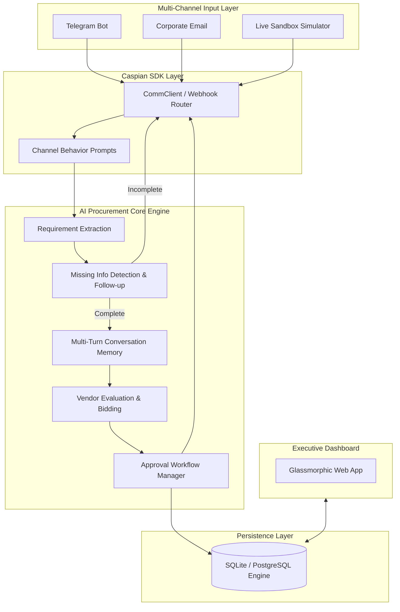

# ⚡ ProcureAI - Enterprise AI Procurement Agent with Caspian SDK

An enterprise-grade autonomous AI Procurement Agent powered by **Caspian SDK**, orchestrating seamless procurement workflows across **Telegram**, **Corporate Email**, and a real-time **Web Dashboard**.

---

## 🌟 Core Features

### 1. Multi-Channel Requirement Ingestion (Caspian SDK)
- **Telegram Bot Integration:** Employees or managers can submit natural language procurement requests or reply directly to approval prompts.
- **Email Gateway:** Processes inbound procurement inquiries with structured markdown/HTML responses and executive approval summaries.
- **Interactive Channel Simulator:** Built-in live browser sandbox allowing zero-friction local testing of Telegram and Email conversations.

### 2. Multi-Turn AI Requirement Extraction & Structuring
- **Extraction Engine:** Extracts Product Name, Quantity, Budget, Delivery Timeline, and Technical Specifications.
- **Missing Information Detection:** Automatically identifies missing mandatory requirements and formulates intelligent, contextual follow-up questions.
  - *Example:* User asks `"Need 100 laptops."` $\rightarrow$ Agent asks `"What is your budget and required delivery timeline?"`
- **Structured JSON Conversion:** Normalizes unstructured chats into standardized JSON payloads.

```json
{
  "product": "Laptop",
  "quantity": 100,
  "budget": 4500000,
  "delivery_days": 10,
  "specifications": [
    "i5",
    "16GB RAM",
    "512GB SSD"
  ]
}
```

### 3. Automated Vendor Bidding & Scoring Engine
- Generates competitive vendor quotes (e.g. Dell Partner, HP Commercial Direct, Lenovo Premier).
- Calculates cost savings vs. initial budget and compares delivery timelines.
- Selects the optimal vendor recommendation.

### 4. Interactive Approval Workflow
- Dispatches approval requests to managers across Telegram and Email:
```text
Recommended Vendor: Dell Partner
Price: ₹41.5 lakh
Delivery: 7 Days

Approve or Reject?
```
- Managers can approve/reject via Telegram buttons, email replies (`APPROVE` / `REJECT`), or the web dashboard.

### 5. Procurement Ticket Lifecycle Management
- Generates sequential unique identifiers: `PROC-2026-001`, `PROC-2026-002`, etc.
- Tracks lifecycle stages:
  $$\text{Open} \longrightarrow \text{Vendor Search} \longrightarrow \text{Negotiation} \longrightarrow \text{Approval Pending} \longrightarrow \text{Approved / Rejected} \longrightarrow \text{Completed}$$

---

## 🏗️ Architecture



---

## 🚀 Quick Start

### 1. Installation

```bash
# Clone repository
git clone https://github.com/KhushiTrivediii/caspin-agent.git
cd caspin-agent

# Install dependencies
pip install -r requirements.txt
```

### 2. Configuration (`.env`)

Copy `.env.example` to `.env`:

```env
# Caspian SDK Configuration (Optional: runs in Sandbox mode if empty)
CASPIAN_API_KEY=
CASPIAN_BASE_URL=https://api.trycaspianai.com

# Channel Connectors
TELEGRAM_BOT_TOKEN=
TELEGRAM_BOT_USERNAME=ProcurementAIBot
EMAIL_ADDRESS=procurement@enterprise.internal

# Server
PORT=8000
HOST=0.0.0.0
```

### 3. Run the Server

```bash
python -m backend.main
```

Open your browser at:
👉 **[http://localhost:8000](http://localhost:8000)**

---

## 📡 REST API Reference

| Method | Endpoint | Description |
|---|---|---|
| `GET` | `/procurements` | List all procurement tickets (filter by `status`, `channel`, `search`) |
| `GET` | `/procurement/{id}` | Get full ticket details with vendor quotes and audit trail |
| `POST` | `/procurement` | Directly create a structured procurement ticket |
| `POST` | `/procurement/{id}/approve` | Authorize and approve a vendor recommendation |
| `POST` | `/procurement/{id}/reject` | Reject a procurement request |
| `POST` | `/procurement/{id}/advance-stage` | Advance ticket through workflow stages |
| `POST` | `/api/channels/simulate-message` | Multi-channel message simulator for Telegram & Email |
| `GET` | `/api/stats` | Executive KPI analytics and cost savings metrics |

---

## 🧪 Automated Testing

Run the end-to-end test suite:

```bash
python test_procurement_agent.py
```

---

## 📄 License
MIT License
